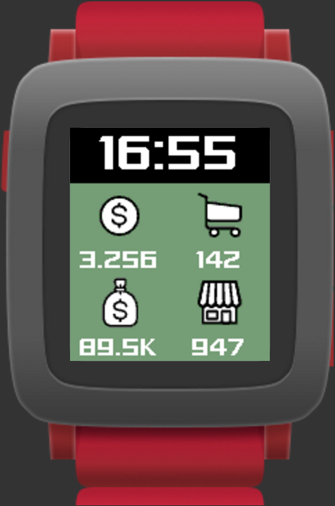
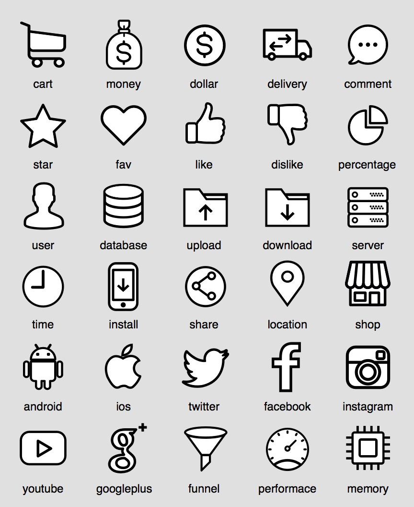
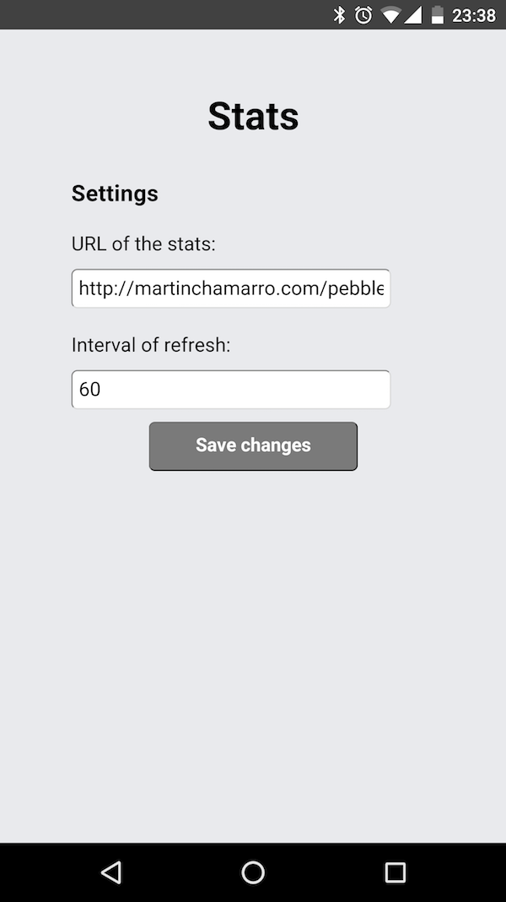
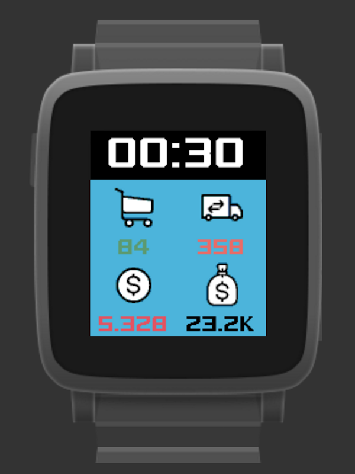
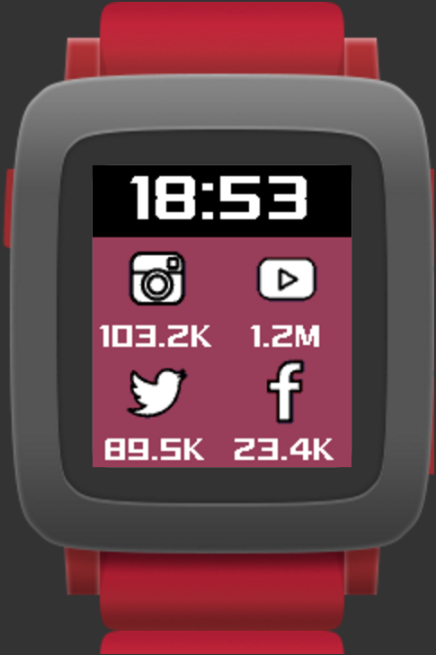
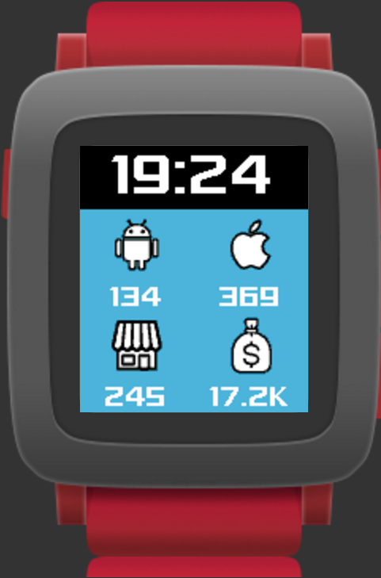
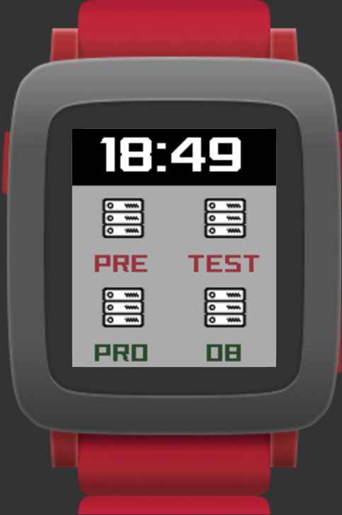
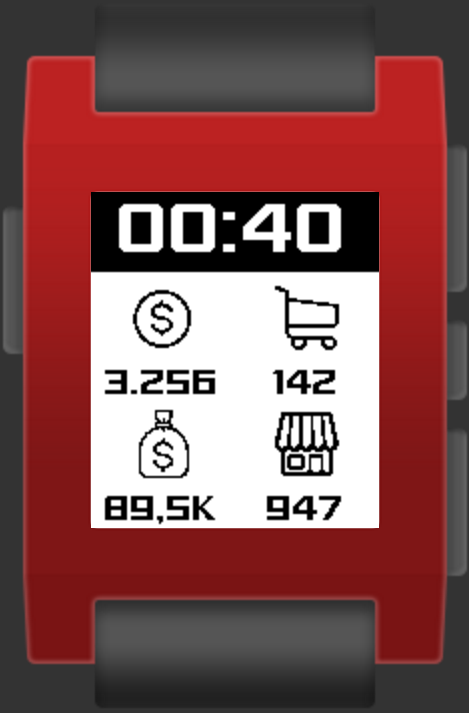

# Stats for Pebble

A simple Pebble watchface to show info like:

* Your server status
* KPIs of your project
* Social Media metrics
* Revenues, installations...

It has 4 configurable values:

The values are loaded from a remote JSON like this:

~~~json
{
	"vibration" : "short",
	"background_color" : "#69B76B",
	"data" : [
		{
			"icon" : "dollar",
			"color" : "#FFFFFF",
			"value" : "3.256"
		},
		{
			"icon" : "money",
			"color" : "#FFFFFF",
			"value" : "89,5K"
		},
		{
			"icon" : "cart",
			"color" : "#FFFFFF",
			"value" : "142"
		},
		{
			"icon" : "shop",
			"color":"#FFFFFF",
			"value" : "947"
		}
	]
}
~~~

As you can see:

* There's a **vibration** param. It supports the following modes: *none* | *short* | *large*. This params indicates if the Pebble has to vibrate in the next update of the statistics.
* It's possible to set the **background** and the **value** colors. You can set whatever HTML color, but it may be converted to the most similar Pebble supported color. There's a palette [here](https://developer.pebble.com/guides/tools-and-resources/color-picker/).
* There're 30 available [icons](resources/images). You just have to set one of these names:

This is the settings screen of the watchface:

You can set:

* The **url** of the JSON that contains the configuration of the watchface.
* The refresh **interval** in minutes (30 by default).

### How to install it

The watchface isn't in the Pebble Store by now. There are two options:

* Clone the project and compile it by yourself.
* Download the latest build from [here](build/).

To install a **.pbw** in your Pebble, you just need to open it from the official Pebble app in your smartphone.

### Examples

The icons are designed by Freepik and distributed by [Flaticon](http://www.flaticon.com/). I just downloaded and updated them to Pebble.
