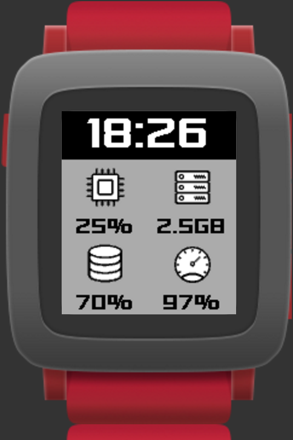

# Stats for Pebble

A simple Pebble watchface to show info like:

* The KPIs of your project
* The status or your servers.

It has 4 configurable values:

The shown values are loaded from a remote JSON like this:

~~~json
{
	"vibration" : "short",
	"background_color" : "#69B76B",
	"data" : [
		{
			"icon" : "cart",
			"color" : "#FFFFFF",
			"value" : "73"
		},
		{
			"icon" : "dollar",
			"color" : "#FFFFFF",
			"value" : "3.456"
		},
		{
			"icon" : "delivery",
			"color" : "#FFFFFF",
			"value" : "254"
		},
		{
			"icon" : "money",
			"color":"#FFFFFF",
			"value" : "18K"
		}
	]
}
~~~

As you can see:

* There's a **vibration** param that supports the following modes: *none* | *short* | *large*. This params indicates if the Pebble has to vibrate in the next update of the statistics.
* It's possible to set the **background** and the **value** colors. You can set whatever hexadecimal color, but it may be converted to the next Pebble supported color. There's a palette [here](https://developer.pebble.com/guides/tools-and-resources/color-picker/).
* The available icons are in [this folder](resources/images). You just have to write the name of the icon to show.

This is the settings screen of the Wathface:

You can set:

* The **url** of the JSON that contains the configuration of the watchface.
* The refresh **interval** in minutes (30 by default).

### Examples

